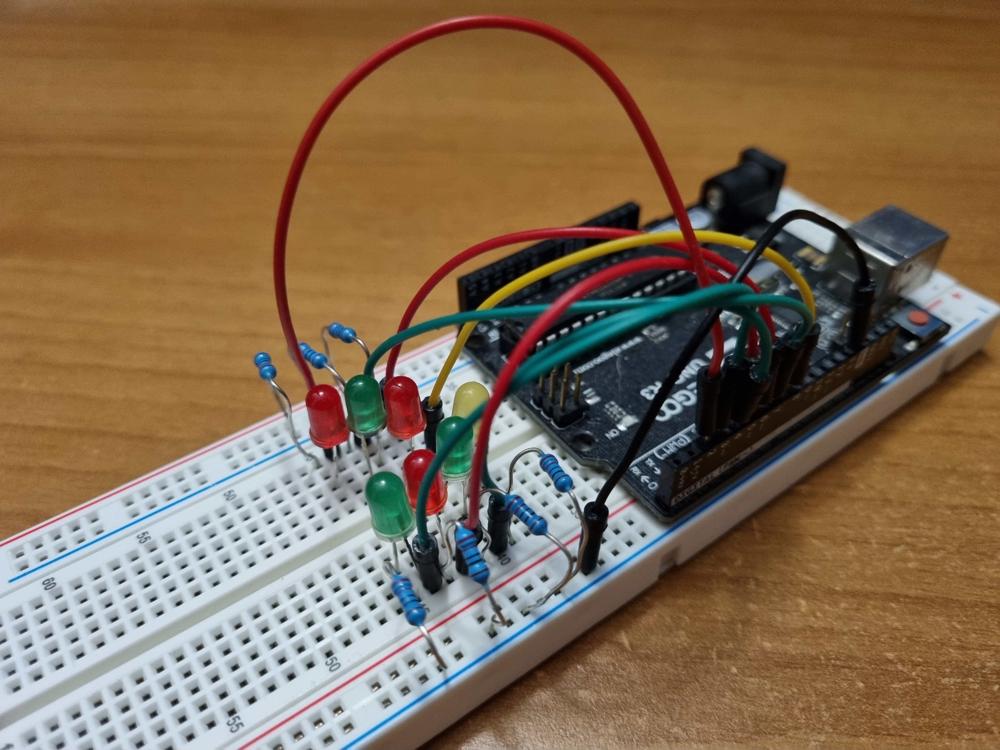

# XMAS TREE

This project implements a Christmas tree using an Arduino Uno and LEDs.

## PREREQUISITES

### Hardware

* x1 Arduino Uno
* x1 breadboard
* x3 red LEDs
* x3 green LEDs
* x1 yellow LEDs
* x7 220 Ohm resistors
* x10 jumper wires male-to-male

### Software

* Debian-based Linux distro
* rustc / cargo
* gcc-avr
* avrdude

## PREREQUISITES INSTALLATION

### rustc and cargo

To download and run *rustup*, execute the following command:

    curl --proto '=https' --tlsv1.2 -sSf https://sh.rustup.rs | sh

*rustup* allows to install and configure the Rust compiler (*rustc*) and package manager (*cargo*).

### AVR toolchain and flash programmer

The following commands allow to install the necessary AVR tools:

    sudo apt update
    sudo apt install gcc-avr
    sudo apt install avrdude

AVR is the architecture that the Arduino Uno microcontroller is based on (*ATmega328P* microcontroller).

## PROJECT SETUP

### Dependencies

In the project *Cargo.toml* file:

1. Add the dependency for the panic handler under the *[dependencies]* section:
    ```
    [dependencies]
    panic-halt = "0.2.0"
    ```
2. Add the dependency for the AVR HAL at the end of the file:  
    ```
    [dependencies.arduino-hal]
    git = "https://github.com/Rahix/avr-hal"
    rev = "4cbb163"
    features = ["arduino-uno"]
    ```
3. Change the *edition* field at the top of the file:
   ```
    edition = "2018"
   ```

At the end run the following command to setup the project

    cargo update

### Target

1. Create a folder called *.cargo* in the project root directory
2. Inside the new folder create a file called *config.toml*
3. Write the following lines in the *config.toml* file:
    ```
    [build]
    target = "avr-atmega328p.json"

    [unstable]
    build-std = ["core"]
    ```
4. Download the *avr-atmega328p.json* file from https://github.com/Rahix/avr-hal/tree/main/avr-specs inside the project root directory
5. If not already present, at the end of the *avr-atmega328p.json* file add the field:
    ```
    "panic-strategy": "abort"
    ```

### Rust buildchain version
 
Run the command:

    rustup override set nightly-2021-01-07

This will set the rust buildchain to a version which is compatible with the AVR toolchain.

## COMPILING & FLASHING

To compile the project run the command

    cargo build

for the debug version, or

    cargo build --release

for the release (optimized) version.

This will create a *xmas-tree.elf* file inside the *target/avr-atmega328p/debug* or *target/avr-atmega328p/release* folder.

To flash the program to the Arduino:

1. Connect the Arduino to the computer via the USB cable
2. Run the commands:
    ```
    cd target/avr-atmega328p/debug
    ```
    or
    ```
    cd target/avr-atmega328p/release
    ```
    then
    ```
    avrdude -p m328p -c arduino -P /dev/ttyACM0 -b 115200 -U flash:w:xmas-tree.elf
    ```

where */ttyACM0* is usually the device file associated to a connected Arduino.

## WIRING

The image below shows the circuit.



Every LED is controlled separately by a specific Arduino digital pin; digital pins number 2 through 8 were chosen.

Every LED is connected to ground through a 220 Ohm resistor. One of the ground rails of the breadboard is connected to one of the Arduino GND pins, while the other rail is wired to the first one.